# Emoji Stash

My collection of emojis and gifs for Discord and Slack.

## Usage

1. Drop original images into `originals/` (use subfolders to categorize)
2. Run `./build.sh` to generate platform-ready versions in `discord/` and `slack/`
3. Run `./generate-readme.sh` to update this README
4. Run `./verify.sh discord/` or `./verify.sh slack/` to check constraints

## Uncategorized

| | | | | | |
|:---:|:---:|:---:|:---:|:---:|:---:|
| 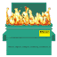 |  | 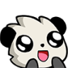 | 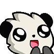 | 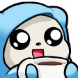 |  |
| 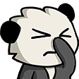 |  |  |  | 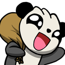 |  |
|  | 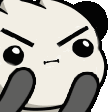 |  |  | 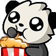 |  |
|  | 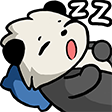 |  | 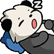 |  | 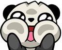 |
|  |  |  |  |  |  |
|  |  | 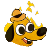 | | | |

